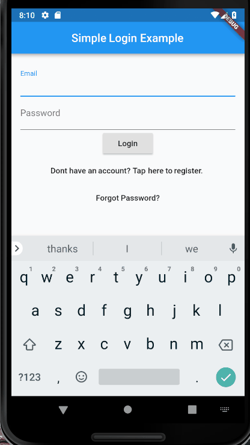

# Flutter Simple Login Example

A new flutter demo application built to show users how to construct a simple login page
with only the use of Text Fields and TextEditingControllers, and without the user of a built-in
Form.

Here is an example of the application in action:

